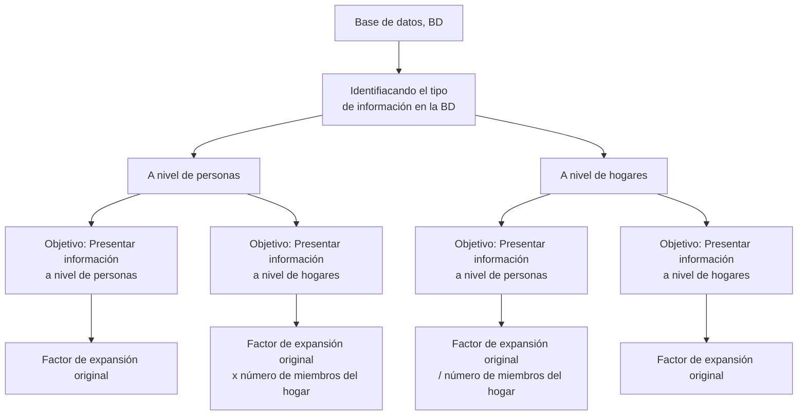

## Guía para la Aplicación de Factores de Expansión en la ENAHO usando Stata
Por: Alejandro Pérez Portocarrero


La correcta aplicación de los factores de expansión en la ENAHO depende del tipo de base de datos utilizada (a nivel de personas o a nivel de hogares) y del tipo de resultados que se desean presentar (a nivel de personas o a nivel de hogares).

1. Resultados a Nivel de Personas

1.1. Si se utiliza una base de datos a nivel de personas (por ejemplo, el módulo 300 Educación de la ENAHO con 108,354 observaciones como muestra) y se desean presentar resultados a nivel de personas, debe emplearse el factor de expansión incluido en la base de datos (factor07).
 
 ``` js
 use "$ruta\1. Bases de datos\1.1. Externas (INEI)\1.1.1. ENAHO\module 03\2023\2023.dta"
 tab a_o [iw=factor07]
 ```    
 
 | año de la encuesta |     Freq.     | Percent |   Cum.   |
 |--------------------|---------------|---------|----------|
 |               2023 |   33108245.3  |  100.00 |   100.00 |
 |--------------------|---------------|---------|----------|
 |              Total |   33108245.3  |  100.00 |   100.00 |

1.2. Si se utiliza una base de datos a nivel de hogares (por ejemplo, el módulo 340 Sumaria de la ENAHO con 33,886 observaciones como muestra) y se desean presentar resultados a nivel de personas, se debe ajustar el factor de expansión (factor07) multiplicándolo por el número de miembros del hogar (mieperho).

``` js
use "$ruta\1. Bases de datos\1.1. Externas (INEI)\1.1.1. ENAHO\module 34\2023\2023.dta"
tab a_o [iw=factor07*mieperho]
```    

| año de la encuesta |     Freq.     | Percent |   Cum.   |
|--------------------|---------------|---------|----------|
|               2023 |   34107047.6  |  100.00 |   100.00 |
|--------------------|---------------|---------|----------|
|              Total |   34107047.6  |  100.00 |          |


2. Resultados a Nivel de Hogares

2.1. Si se utiliza una base de datos a nivel de personas (por ejemplo, el módulo 300 Educación de la ENAHO con 108,354 observaciones como muestra) y se desean presentar resultados a nivel de hogares, se debe emplear el factor de expansión (factor07), pero dividido por el número de miembros del hogar (mieperho). En este caso, la variable de número de miembros del hogar puede obtenerse mediante un merge con otro módulo como el módulo 340 
 - Sumaria.
 
 ``` js
use "$ruta\1. Bases de datos\1.1. Externas (INEI)\1.1.1. ENAHO\module 03\2023\2023.dta"
merge m:1 conglome vivienda hogar using "$ruta\1. Bases de datos\1.1. Externas (INEI)\1.1.1. ENAHO\module 34\2023\2023.dta"

tab a_o [iw=factor07/mieperho]
 ```     
| año de la encuesta |     Freq.     | Percent |   Cum.   |
|--------------------|---------------|---------|----------|
|               2023 |   10013826.3  |  100.00 |   100.00 |
|--------------------|---------------|---------|----------|
|              Total |   10013826.3  |  100.00 |          |

2.2. Si se utiliza una base de datos a nivel de hogares (por ejemplo, el módulo 340 Sumaria de la ENAHO con 33,886 observaciones como muestra) y se desean presentar resultados a nivel de hogares, solo debe utilizarse el factor de expansión existente en la base de datos.

``` js
use "$ruta\1. Bases de datos\1.1. Externas (INEI)\1.1.1. ENAHO\module 34\2023\2023.dta"
tab a_o [iw=factor07]
```    

| año de la encuesta |     Freq.     | Percent |   Cum.   |
|--------------------|---------------|---------|----------|
|               2023 |   10196775.4  |  100.00 |   100.00 |
|--------------------|---------------|---------|----------|
|              Total |   10196775.4  |  100.00 |          |

Lo anterior puede ser resumido a partir del siguiente diagrama:



* Notas:
