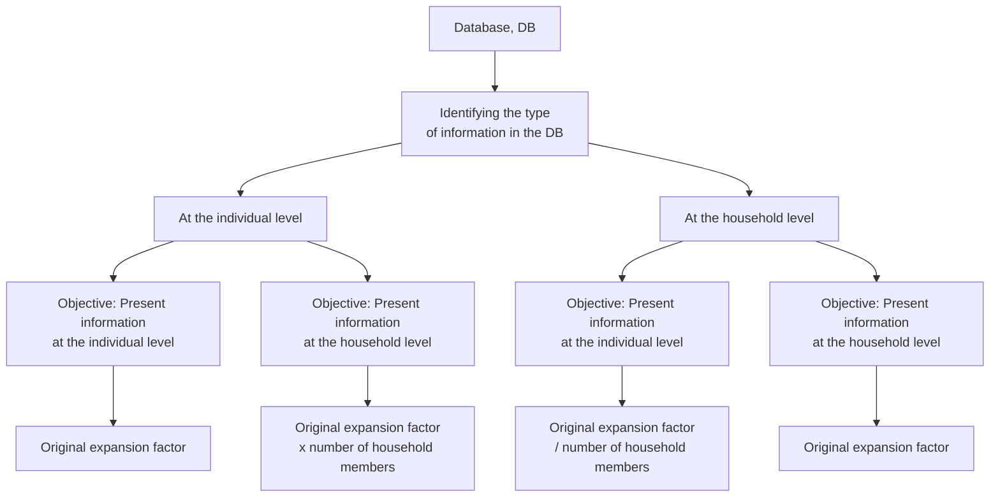

## Guide for Applying Expansion Factors in ENAHO using Stata
By: Alejandro Pérez Portocarrero

The correct application of expansion factors in the ENAHO depends on the type of database used (at the individual or household level) and the type of results to be presented (at the individual or household level).

1. Results at the Individual Level

1.1. If an individual-level database is used (e.g., ENAHO module 300 Education with 108,354 observations as a sample) and results are to be presented at the individual level, the expansion factor included in the database (factor07) should be used.
 
 ``` js
 use "$ruta\1. Bases de datos\1.1. Externas (INEI)\1.1.1. ENAHO\module 03\2023\2023.dta"
 tab a_o [iw=factor07]
 ```    
 
 | año de la encuesta |     Freq.     | Percent |   Cum.   |
 |--------------------|---------------|---------|----------|
 |               2023 |   33108245.3  |  100.00 |   100.00 |
 |--------------------|---------------|---------|----------|
 |              Total |   33108245.3  |  100.00 |   100.00 |

1.2. If a household-level database is used (e.g., ENAHO module 340 Summary with 33,886 observations as a sample) and results are to be presented at the individual level, the expansion factor (factor07) should be adjusted by multiplying it by the number of household members (mieperho).

``` js
use "$ruta\1. Bases de datos\1.1. Externas (INEI)\1.1.1. ENAHO\module 34\2023\2023.dta"
tab a_o [iw=factor07*mieperho]
```    

| año de la encuesta |     Freq.     | Percent |   Cum.   |
|--------------------|---------------|---------|----------|
|               2023 |   34107047.6  |  100.00 |   100.00 |
|--------------------|---------------|---------|----------|
|              Total |   34107047.6  |  100.00 |          |


2. Results at the Household Level

2.1. If an individual-level database is used (e.g., ENAHO module 300 Education with 108,354 observations as a sample) and results are to be presented at the household level, the expansion factor (factor07) should be used, but divided by the number of household members (mieperho). In this case, the number of household members can be obtained by merging with another module such as module 340 - Sumaria.

 ``` js
use "$ruta\1. Bases de datos\1.1. Externas (INEI)\1.1.1. ENAHO\module 03\2023\2023.dta"
merge m:1 conglome vivienda hogar using "$ruta\1. Bases de datos\1.1. Externas (INEI)\1.1.1. ENAHO\module 34\2023\2023.dta"

tab a_o [iw=factor07/mieperho]
 ```     
| año de la encuesta |     Freq.     | Percent |   Cum.   |
|--------------------|---------------|---------|----------|
|               2023 |   10013826.3  |  100.00 |   100.00 |
|--------------------|---------------|---------|----------|
|              Total |   10013826.3  |  100.00 |          |

2.2. If a household-level database is used (e.g., ENAHO module 340 Summary with 33,886 observations as a sample) and results are to be presented at the household level, the existing expansion factor in the database should be used.

``` js
use "$ruta\1. Bases de datos\1.1. Externas (INEI)\1.1.1. ENAHO\module 34\2023\2023.dta"
tab a_o [iw=factor07]
```    

| año de la encuesta |     Freq.     | Percent |   Cum.   |
|--------------------|---------------|---------|----------|
|               2023 |   10196775.4  |  100.00 |   100.00 |
|--------------------|---------------|---------|----------|
|              Total |   10196775.4  |  100.00 |          |

The above can be summarized by the following diagram:



* Note: I thank Antony Velasquez Perez for his valuable comments.
